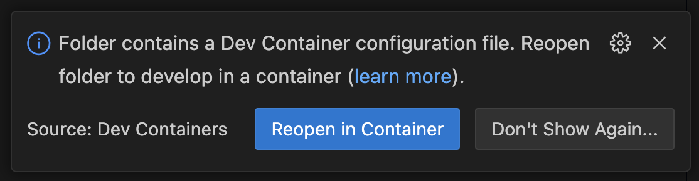

# MCP Workshop

This workshop is intended to teach you the basics of the Model Context Protocol (MCP). It will specifically have you do the following:

- Start a simple chatbot with no interactions
- Add a simple MCP server to allow the LLM to have access to realtime information
- Create your own test MCP server

## Requirements

- [Docker Desktop](https://www.docker.com)
- [VS Code](https://code.visualstudio.com/download)
- The [Dev Containers extension](https://marketplace.visualstudio.com/items?itemName=ms-vscode-remote.remote-containers) for VS Code

## Setup

1. Clone the repository:

   ```bash
   git clone https://github.com/dockersamples/mcp-workshop.git
   cd mcp-workshop
   ```

2. Open the project in VS Code

3. When prompted, click the **Reopen in Container** button to open the project in a devcontainer.

   

   - **NOTE 1:** If you miss the dialog or accidentally close it, you can launch it by going to **View** -> **Command Palette...** -> **Dev Containers: Reopen in Container**

   - **NOTE 2:** It may take a little while to get started, as multiple container images will be downloaded and built, Python dependencies will be installed, etc. It'll come up soon though!

4. Create a `bot/.env` file and add your API key:

   ```plaintext
   LLM_SOURCE=openai
   IN_CONTAINER=true # doesn't matter unless using ollama
   OPENAI_API_KEY=sk-proj-hNHhZ-rest-of-key
   ```

You're ready to go! Go to [the Workshop Guide](./guide.md) to get started with the workshop!

## License

This workshop is licensed under the [MIT License](./LICENSE). Portions of this repo were leveraged from the [3choff/mcp-chatbot project](https://github.com/3choff/mcp-shatbot).
